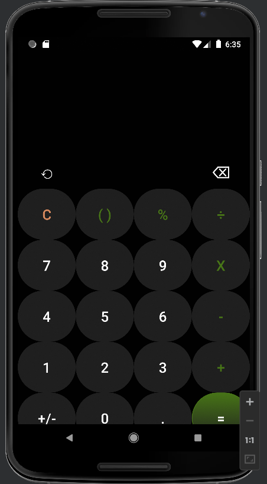
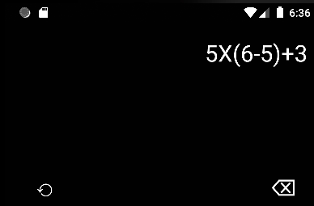
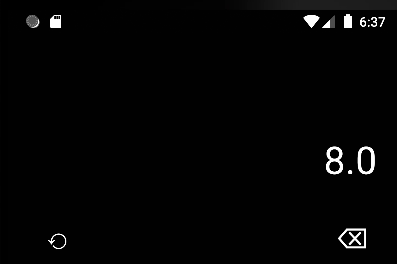
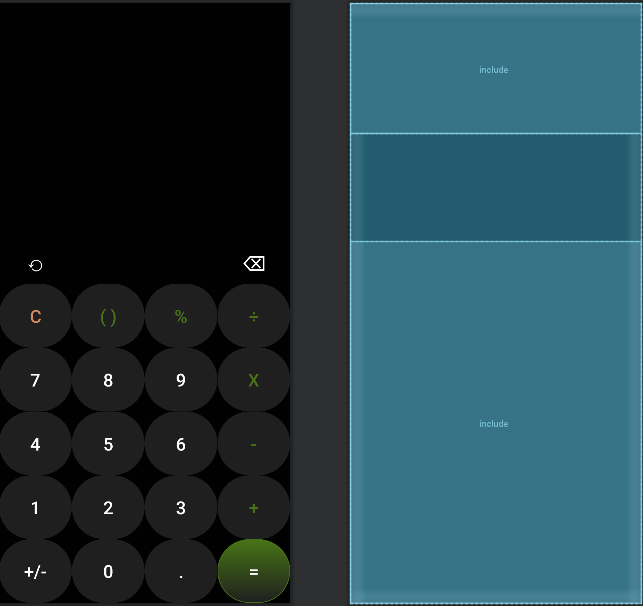
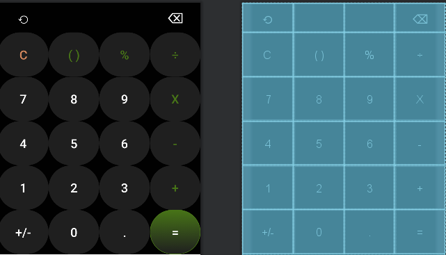

# EL_Calculator

EL Calculator is a Android Application implemented using Java, Android Studios, that almost works like a Samsung Calculator Clone.
  

# Video Link for the Project

The project walkthrough can be viewed [HERE]()
  

# Description
An android calculator for programmer.

This is an android app. A calculator for programmer.

This is the sourse code of the app that the version is 1.1.
  

# Functionalities
Application Default Screen
   
Mathematical Equasion
   
Output
   
Application Strcture
   
Buttons Strcture
 
  

# Requirements
* Android Studios
* Java JDK

  

# License

© Abhinav Mathur (ELLIPSIS)

Licensed under [MIT License](LICENSE).
